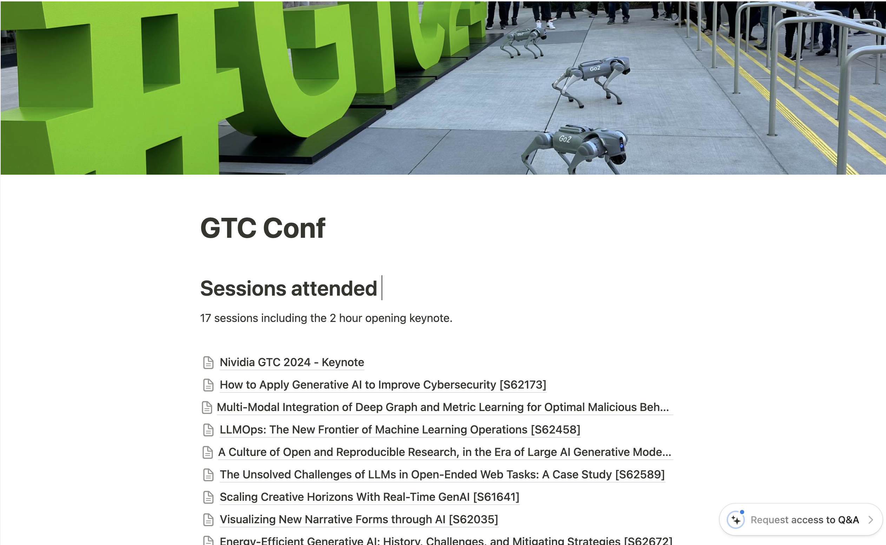
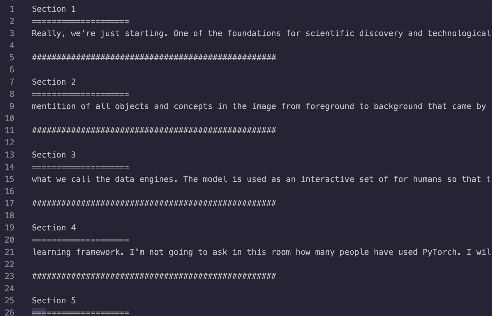
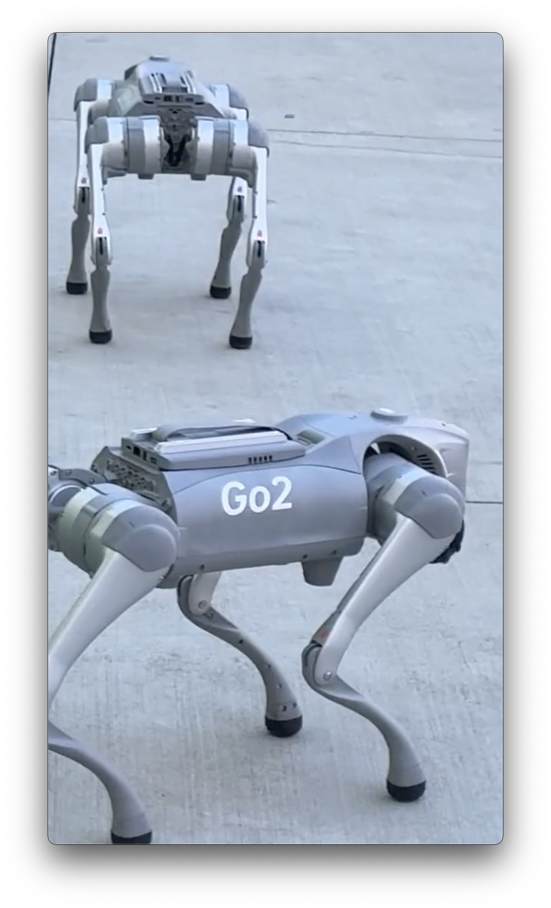

# Using the tools to generate a Trip Report

## Steps

Audio was recorded for each session. This was done on an iPhone. The output file was `.m4a`

1. To transcribe the audio, it first needed to be converted from `.m4a` to `.mp3`. This was done with the **🎵 [Apple Audio to MP3 Converter](services/apple-to-mp3/convert_m4a_to_mp3_README.md)** below.

2. Once the format was in `.mp3`, use the **📝 [Transcribe TXT - Generates (TXT) Transcription from Mp3](services/transcribe/transcribeTXT_README.md)** script to transcribe the audio into a text file. Depending on the quality of the recording, some manual cleanup may be necessary.

3. The goal now is to summarize the transcript. However, most transcriptions are very large and exceed the context window of popular tools such as ChatGPT. In order to provide the full transcript to ChatGPT, it first must be broken up into smaller "chunks". These can then be sent as individual prompts and summarized. Use the **📄 [Chunk](services/chunk/chunk_README.md)** script to accomplish this followed by ChatGPT to summarize.

4. If you are interested in identifying the keywords in the transcript, use the **🔍 [Key Words](services/key_words/key_words_README.md)** script. You may need to add additional words to the "dictionary" of words to ignore. It'll make sense when you look at the code.

5. If you have video footage you want to combine into one brief "montage" for use in the trip report, you can use the **[Crop - Crop videos segments](services/clip/clip_README.md)** script to crop a horizontal video so it is formatted as a portrait (the final output). 

6. The **[Montage - Concactenate Multiple Videos](services/montage_README.md)** script will clip random sections from multiple videos and combine them into 5 different videos you can choose from.

## Written Content

1. **🎵 [Apple Audio to MP3 Converter](services/apple-to-mp3/convert_m4a_to_mp3_README.md)**: converts M4A audio files to MP3 format using FFmpeg.

2. **📝 [Transcribe TXT - Generates (TXT) Transcription from Mp3](services/transcribe/transcribeTXT_README.md)**: Transcribes audio into written text with timestamps using OpenAI's Whisper model, ideal for generating accurate subtitles.

3. **📄 [Chunk](services/chunk/chunk_README.md)**: chunks a large text file into smaller sections, each with a specified maximum number of tokens, and saves the output as a new text file.

4. **🔍 [Key Words](services/key_words/key_words_README.md)**: Analyze a text file, filtering out common "stop words" and additional uninteresting words to identify and count the most meaningful words.

## Media Content

5. **[Crop - Crop videos segments](services/clip/clip_README.md)**: automates the process of cropping videos to a portrait orientation, focusing on the center of the video.

6. **[Montage - Concactenate Multiple Videos](services/montage_README.md)**: Create a video montage by clipping random sections from each video in a specified directory and merging them into a new video of a predetermined length. 

